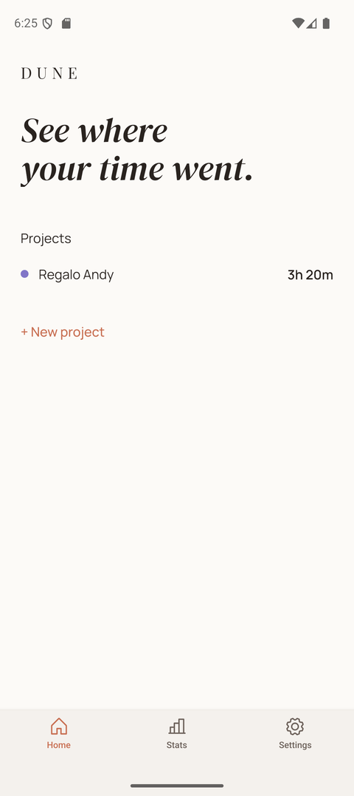
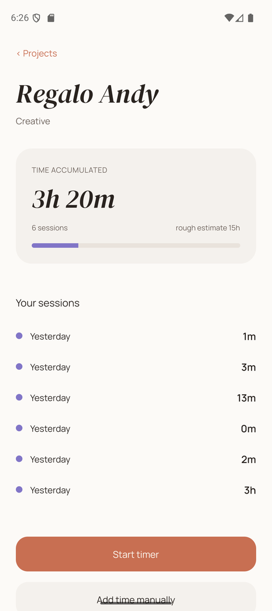
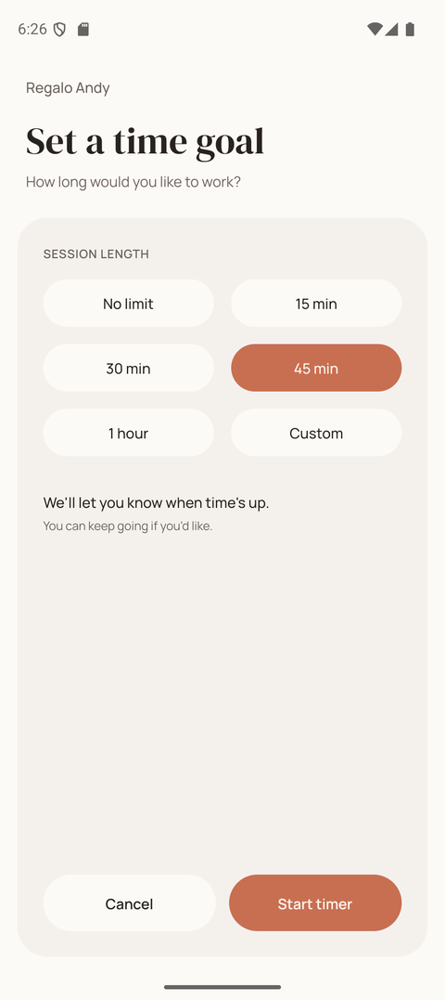
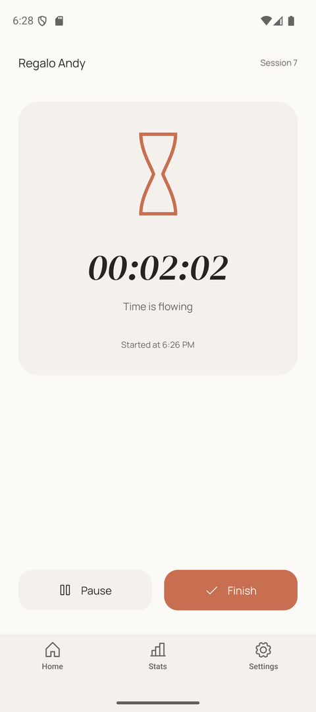
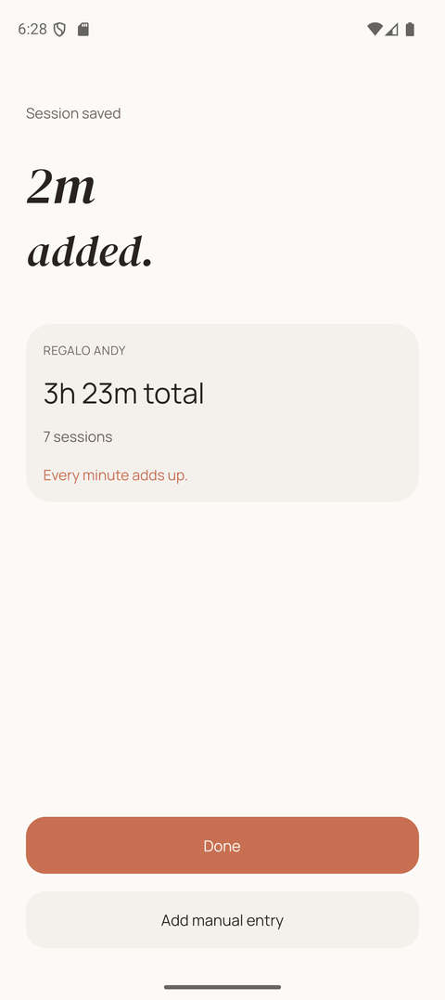

# Dune

> Time accumulates.

[](https://github.com/adelagranados/dune/actions/workflows/ci.yml)

Dune is a personal time-tracking app for projects. The question it answers is
"how long did this actually take me?" — not employee productivity, not billing.
No streaks, no scores, no guilt.

It is a personal product and a portfolio project, built with the architecture a
real product would need rather than as a demo.

|                Home                |                        Project                         |                          Goal                          |                       Timer                        |                        Saved                         |
| :--------------------------------: | :----------------------------------------------------: | :----------------------------------------------------: | :------------------------------------------------: | :--------------------------------------------------: |
|  |  |  |  |  |

## Status

Working end to end, verified on an Android device:

- **Projects** — create, with a free-text category, colour and optional time
  estimate; a detail screen with the accumulated total and progress against
  that estimate
- **Timer** — session length goal, pause/resume, finish; survives backgrounding,
  the lock screen and a full app relaunch
- **Target notifications** — a local reminder when the goal is reached,
  rescheduled around pauses
- **Manual entry** — add time tracked outside the app
- **Design system** — semantic light/dark tokens extracted from Figma
- **i18n** — English and Spanish, following the device language

Not built yet: **Stats**, **Settings** and **Project Completed**. iOS has not
been run yet. See the [issue board](https://github.com/adelagranados/dune/issues)
for what is left.

## How the timer works

This is the part worth reading.

The timer never counts. There is no interval incrementing a number, because any
such number is wrong the moment the OS suspends the process. Instead a session
is three timestamps, and elapsed time is always **derived**:

```ts
elapsed = (pausedAt ?? now) - startedAt - accumulatedPausedMs;
```

`startedAt` is fixed when the session begins and never changes. A pause records
when it began; resuming folds that interval into `accumulatedPausedMs`. There is
nothing to "resume" after the app is killed, because nothing was ever running —
reading the three timestamps back from storage reconstructs the exact elapsed
time. The 1-second tick in the UI only triggers a re-render; it is not the
source of truth.

The engine in [`src/domain/timer/timerEngine.ts`](src/domain/timer/timerEngine.ts)
is pure, has no React Native dependency, and takes `now` as an explicit argument
rather than calling `Date.now()` internally — which is what makes the whole
thing testable with fixed timestamps.

**The target is a reminder, not a cap.** Reaching it never stops the timer, and
the session records the real elapsed time, however far past the goal it ran.

### Why the notification is not state

The target is measured in **active work time**, but a notification can only be
scheduled against **wall-clock time**. Those two line up only while the timer is
running, so the scheduled notification is never trusted — it is re-derived from
the timer on every transition:

| Transition | What happens                                 |
| ---------- | -------------------------------------------- |
| Start      | schedule at `now + target`                   |
| Pause      | cancel — a frozen clock has no future moment |
| Resume     | schedule at `now + remaining active time`    |
| Finish     | cancel                                       |

A 45-minute goal paused for 20 minutes fires 65 minutes after the start.
Verified against `dumpsys alarm` on a device: a 74-second pause moved the
scheduled alarm by exactly 74 seconds.

## Architecture

Four layers, with the dependency arrows pointing inward:

- **`src/domain`** — pure functions. No React, no React Native, no I/O. Where
  the rules live, and the only layer with unit tests.
- **`src/data`** — SQLite (Drizzle) for projects and sessions, a small
  key/value table in the same database for the active timer and settings, and
  the notification scheduler. Adapters, not rules.
- **`src/state`** — Zustand stores that orchestrate the two above and own the
  side effects.
- **`app` / `src/ui`** — Expo Router screens and the design system.

Two consequences worth naming:

- The scheduled notification's id lives under its own key rather than on the
  `ActiveTimer` type. It belongs to the OS scheduler, not to the session, and
  keeping it out leaves the domain type free of platform concerns.
- The key/value table is created with a raw statement rather than a Drizzle
  migration, because the active timer is read at module load — before
  `useMigrations` has had a chance to run.
- Rescheduling a notification is deliberately not awaited. The timer is the real
  record of the session; a slow or failing scheduler must never delay the UI or
  lose time.

## Stack

- **Expo SDK 57** + **Expo Router**
- **TypeScript**, strict
- **Zustand** for UI and orchestration state
- **expo-sqlite** + **Drizzle ORM** for projects and sessions, and for the
  handful of key/value reads the timer needs synchronously at startup
- **expo-notifications** for target reminders
- **i18next** / **react-i18next**, with **expo-localization**
- **Phosphor Icons**, **react-native-svg**
- **Vitest** for the domain layer

Offline-first by design: there is no backend, and the schema is shaped so sync
could be added later without a migration.

## Getting started

```bash
npm install
npm run android   # or: npm run ios (requires macOS)
```

### Running in Expo Go

`npx expo start` and scanning the QR also works, which is the only way to run
this on an iPhone without a Mac — but it is not the whole app:

|         | Expo Go                                                                                                                                |
| ------- | -------------------------------------------------------------------------------------------------------------------------------------- |
| iOS     | everything except config plugins, so the notification icon and colour fall back to Expo's                                              |
| Android | the same, **and no target reminders** — `expo-notifications` throws there rather than degrading, so the app treats them as unavailable |

On Android a development build removes that limit and costs nothing: attach the
phone over USB and run `npm run android`.

> `.npmrc` sets `legacy-peer-deps`: Expo SDK 57 pins `react` 19.2.3 while
> `react-dom` resolves to 19.3.0, so a plain install otherwise fails with
> `ERESOLVE`.

### After changing native config

`android/` and `ios/` are generated and not tracked. `npm run android` reuses
whatever is already there, so **changes to `app.json` — the app name, a config
plugin, an icon — are silently ignored until the native project is
regenerated**:

```bash
npm run prebuild   # expo prebuild --clean
npm run android
```

This is easy to miss, because the app builds and runs fine with the stale
configuration. A config plugin that was added but never prebuilt simply has no
effect.

### Windows note

If the Android build fails with `Filename longer than 260 characters` during a
native module's C++ codegen step, check that `react-native-gesture-handler`
matches the version Expo's compatibility table recommends
(`npx expo install --check`). A newer major version restructured its Fabric
codegen paths in a way that exceeds Windows' path limit — enabling long paths in
the registry does **not** fix it, because the bundled `ninja.exe` is not
long-path aware.

## Development workflow

`main` is protected: it only moves through pull requests that pass CI.

```bash
git checkout -b feat/<issue>-<short-name>
# ... work, commit ...
gh pr create          # the template asks for what / why / how it was verified
```

Every pull request runs the same four checks, cheapest first:

```bash
npm run format:check
npm run lint
npm run typecheck
npm test
```

PRs are squash-merged, so one issue becomes one commit on `main`.

## Project structure

```
app/                    # Expo Router routes (screens)
src/
  domain/               # Pure business logic (timer engine, project rules, stats)
  data/
    db/                 # Drizzle schema, client, migrations
    kv/                 # Synchronous key/value store (active timer, settings)
    repositories/       # Queries over the SQLite layer
    notifications/      # Local notification scheduling
  state/                # Zustand stores (orchestration + side effects)
  ui/                   # Design system components, theme tokens, icons
  i18n/                 # Translations
  lib/                  # Small framework-agnostic helpers
docs/
  color-tokens.md       # Where the code's palette differs from Figma, and why
  screenshots/          # Images used by this README
```

## License

[MIT](LICENSE)
